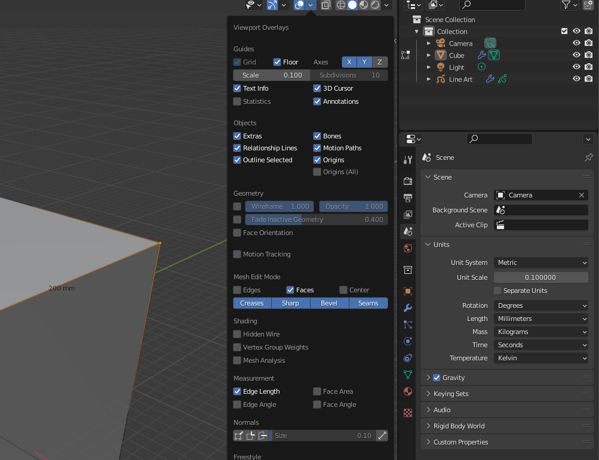

Set the blender scripts directory (Edit -> Preferences -> File Paths -> Scripts) to this folder, eg `~/total-perspective-vortex/blender/`.

Run the generator script from the `./defgen` folder from blender. On my system:

`/Applications/Blender.app/Contents/MacOS/Blender -b -P "/Users/michaelorenstein/Documents/Projects/total-perspective-vortex/blender/defgen/pypredef_gen.py"`

---

PyCharm defs, go PyCharm -> Preferences -> Project: Addons -> Project Structure -> Add Content Root (on the right).

Add the `./defgen/pypredef` folder.

---

To increase the max size of files that get code insight, go Help -> Edit Custom Properties, enter `idea.max.intellisense.filesize=999999`

---

Blender must be run from the command line in order to get console output.

---

For better scale, in edit mode, set the grid scale to 0.1, the unit scale to 0.1, the length to millimeters.

This makes a 10x sized cube 200mm across in each direction, roughly the render volume

